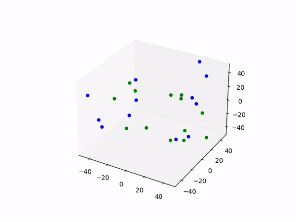

# Population Simulation

Simulate the growth of two kinds of creatures. One with a high reproduction rate and a low life expectancy, and another with a low reproduction rate and a high life expectancy.

For complete execution of this program, the user will need OpenCV, Matplotlib, Ffmpeg (installed externally), and Numpy. Most of this can be installed with pip. Ffmpeg is available from [here](https://ffmpeg.org/). For Ffmpeg, it requires being added to system variables. For more help, there are tutorials on how to install it.
I should mention that ffmpeg is only for saving the video of the initial animation. This allows for a simpler visualization. The reason why will be explained further in the problems section below.

## Logic of the Program

This program creates 2 sets of scatter dots in a 3D subplot from matplot. Each one of them represents one kind of creature.
Green: Good at reproduction, poor at survival.
Blue: Good at surviving, bad at reproducing.

The dots created behave like balls bouncing in a cage. Which is the environment created for them. A space of 100x100 in the maptplot lib.

### Order of events in the Program

1: The creation of objects and scenarios
2: Events are computed and all data is stored in multiple Numpy Arrays
3: Only a fraction of the maximum number of creatures stated appears.This is the initial population.
4: Events take place in an animation, following the data created a couple of steps ago. (This happens visually if plt.show() is at the end of the initialising function.)
5: The animations are saved into a file called animation.mp4.
6: OpenCV reads the.mp4 file and places a day counter at a relatively slow rate.
7: The last frame read by OpenCV causes the video to freeze. Raw video from Matplot is still saved.

### Creature Behaviour

The creatures represented by the blue dots and the green dots do not have complex behaviour. Some of its behaviour can be changed from the populationParams.py file in the [src](https://github.com/SNOWZ7Z/Population-Simulation/tree/main/src) folder.

Currently, this is the birth and death data of the creatures:
Green: 33.3% change in both dying and creation
Blue: 5% Chance of Dying, and 10% Chance of Being Born.

Creatures are born or killed in each frame or iteration of the animation. They're randomly chosen; there is no other.

That way, they never know who's next, Muajajaja *grins evilly*

Aside from that, they have a "bounce of walls" routine 24/7.

## First Working prototype that I've recorded

I saved a sample of my first prototype as soon as I remembered I probably should. This was later on in the project.

<p align="center"></p>

Sorry, I forgor to do so earlier

## Problems I came Accross

The main issues I had to deal with

1: Combine two animations into a single variable to animate.
2: Put in place the creation and deletion of Scatter points or creatures.
3: Make the balls bounce within the cage's confines.
Save the animation created

### Saving animations

Saving two animations into one seemed impossible since there are no "merging" methods for them. This is the problem that took me the most time to solve (approximately 24 hrs). My solution was to start with only one animation and use it to trigger another animation. This can be seen in the following image, in which the animating function calls another animating function that has the animation stored. At the same time, this last animation function calls itself.

```python
def animate_scatters(self, iteration, data, scatters, data2, scatters2):
    for i in range(data[0].shape[0]):
        scatters[i]._offsets3d = (data[iteration][i,0:1], data[iteration][i,1:2], data[iteration][i,2:])
    self.animate_sctrs(iteration, data2, scatters2)
    return scatters

#Second animation of the scatter points that is triggered by the first one. animate_scatters
def animate_sctrs(self, iteration, data, scatters):
    for i in range(data[0].shape[0]):
        scatters[i]._offsets3d = (data[iteration][i,0:1], data[iteration][i,1:2], data[iteration][i,2:])
    animation = ani.FuncAnimation(fig, self.animate_sctrs, iteration, fargs=(data, scatters), interval=50, blit=False, repeat=True)
    return scatters
```

### Creation and Deletion of Creatures

After trying multiple solutions and ideas, I came to the conclusion that altering the data generated so that I could not create an extra field for data during the simulation was the best solution. The same goes for deletion. So I created a second cage that was bigger than the first one and simply set all the other scatter dots very, very far away. A bit of a rustic solution, I have to admit.

One possible improvement for this could be stopping the simulation and resuming with a new set of data, created from the last one minus the creatures to kill. This way, it looks as if there were only one simulation, but there's actually a second one taking the flag from a certain point. I think this would be another possible solution to this problem.

### Creating "bouncy" balls

This might have been the easiest hard problem I've faced. I had no idea how to calculate an angle for proper bouncing while avoiding a loophole.

My solution in the end was If it touches a boundary, invert the speed of the axis that belongs to the movement direction. As a result, the correct bounce angle is simulated.

If it touches the top, the z speed would be set to -(abs), so it's a negative absolute value. Something like this

```python
if new_positions[i][j] >= 50:
                        start_speed[i][j] = -abs(start_speed[i][j])
```

And thus, my balls started to bounce.

### Saving Animation

In order to save the animation smoothly, I decided to use ffmpeg. The tool has proven itself versatile, but its installation is not via pip. It has to be installed manually. This was a deterrent for me at some point since my idea was that anyone could run this from their computer without the need to have the same programmes I had. However, I'm unable to find a solution to that problem yet. This led to the videos being created in an mp4 file by ffmpeg. Here's an example of how to do it (similar to [src](https://github.com/SNOWZ7Z/Population-Simulation/tree/main/src)).

```python
plt.rcParams['animation.ffmpeg_path'] ='C:\\PATH_Programs/ffmpeg.exe'
        FFwriter=ani.FFMpegWriter(fps=30, extra_args=['-vcodec', 'libx264'])
        animation.save('animation.mp4', writer=FFwriter)
```

## Unsolved Problems

### Speed

Currently, the programme takes a long time to compile. That is why there is an old large example shown in the [Examples](https://github.com/SNOWZ7Z/Population-Simulation/tree/main/examples) folder.

### FFMPEG Saving

Another problem it has is technically one of animation saving. The problem cannot be fully solved by any machine. It does not have an.exe yet, and it needs FFMPEG from the user's environment variables.

### Possible solutions and Improvements

Multithreading can be a solution for slow computing times.which I still need to learn. However, part of it is covered by the animation since it allows for easy final visualization. (After loading times)

A solution I think of for the video saving files is using some sort of embeded version of FFmpeg, or trying to find a web api that can do the FFmpeg job from the internet rather than the users' machine. But these are nothing more than current ideas.

---

On a personal note, I thought this would be relatively easy... I was wrong.
Anyways, I've just learned Python, and it's been nice to me until now. I usually code in Java since it's the language I'm learning in my studies. I'm looking forward to building something else in Python, as well as increasing my abilities for a co-op in the future.

---

This was my first public project ever. Thanks for reading if you are here, btw.
